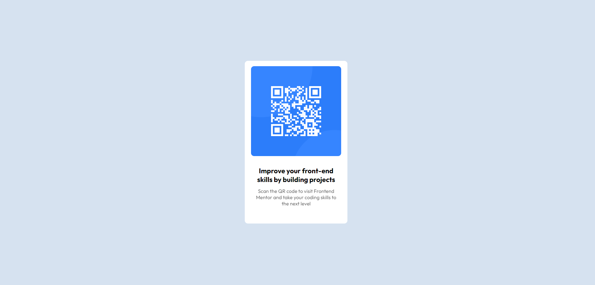

# Frontend Mentor - QR code component solution

This is a solution to the [QR code component challenge on Frontend Mentor](https://www.frontendmentor.io/challenges/qr-code-component-iux_sIO_H). Frontend Mentor challenges help you improve your coding skills by building realistic projects.

## Table of contents

- [Overview](#overview)
  - [Screenshot](#screenshot)
  - [Links](#links)
- [My process](#my-process)
  - [Built with](#built-with)
  - [What I learned](#what-i-learned)
  - [Continued development](#continued-development)
  - [Useful resources](#useful-resources)
- [Author](#author)
- [Acknowledgments](#acknowledgments)

**Note: Delete this note and update the table of contents based on what sections you keep.**

## Overview

I know this would have been simpler with HTML/CSS but I wanted to try out a new skill I acquired which was using React. I am very new with React so this was actually quite the process for me, especially with using styled-components which is what I wanted to try instead of using CSS modules.

### Screenshot

### Links

- Solution URL: [Add solution URL here](https://lighthearted-basbousa-34ddc1.netlify.app/)
- Live Site URL: [Add live site URL here](https://lighthearted-basbousa-34ddc1.netlify.app/)

## My process

I used create-react-app and split the component into two parts, a reusable Card component and the second part is the content that is added to the Card component (QRCodeCard). I think my weakness is in my CSS skills and would love some feedback. I felt like I brute-forced it to look the way it does.

### Built with

- HTML
- CSS
- [React](https://reactjs.org/) - JS library
- [Styled Components](https://styled-components.com/) - For styles

### What I learned

I learned:

- :root pseudoclass in CSS.
- styled-components sending styles over to another component (e.g. using the Card's component and adding onto the style in the QRCodeCard component).
- centering the div to the center of the page

### Continued development

I think I need far more work on CSS-styling and being familiar with the box model and flex display.

### Useful resources

## Author

- Website - [import-turtle](https://github.com/import-turtle)
- Frontend Mentor - [@import-turtle](https://www.frontendmentor.io/profile/import-turtle)

## Acknowledgments
